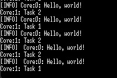

# Thread Handler

## Overview
The **Thread Handler** is a lightweight task management system designed to run on a Raspberry Pi Pico or any RP2040 microcontroller. It enables task scheduling, execution, and management across multiple priorities while utilizing inter-core communication for task delegation. The system is implemented using a FIFO queue to send commands between cores efficiently.

## Features
- **Multicore Support**: Leverages multiple cores to distribute task execution.
- **Task Prioritization**: Supports high, medium, and low-priority tasks.
- **FIFO-Based Communication**: Uses a multicore FIFO queue to manage inter-core commands.
- **Dynamic Task Management**: Allows adding, removing, and executing tasks dynamically.
- **Memory Management**: Expands task storage dynamically as needed.
- **Single-Shot Task Execution**: Supports one-time execution tasks.

## Architecture
- **Core 0**: Responsible for system control and task initiation.
- **Core 1**: Executes tasks based on priority.
- **FIFO Queue**: Used for inter-core communication.
- **Task Structure**: Tasks contain execution functions, arguments, priorities, and execution modes.

## Command Set
The following commands are used to manage tasks through the FIFO queue:
- `ADD_TASK`: Adds a new task to the scheduler.
- `REMOVE_TASK`: Removes an existing task.
- `TASK_DONE`: Marks a task as completed.
- `START_THREAD`: Starts task execution.
- `STOP_THREAD`: Stops task execution.

## API Usage
### Initializing and Starting the Thread Handler
```c
thread_handler_start();
```

### Creating and Adding a Task
```c
void my_task(void *arg) {
    // Task implementation
}

thread_task_t *task = thread_handler_create_task(my_task, NULL, "Task1", HIGH, false);
thread_handler_add_task(task);
```

### Removing a Task
```c
thread_handler_remove_task(task);
```

### Stopping the Thread Handler
```c
thread_handler_stop();
```

## Example Usage
The following example demonstrates how tasks are managed using the thread handler:

```c
void example_task(void *arg) {
    printf("Executing example task with arg: %d\n", *(int *)arg);
}

int main() {
    thread_handler_start();

    int arg1 = 42;
    thread_task_t *task1 = thread_handler_create_task(example_task, &arg1, "ExampleTask", HIGH, false);
    thread_handler_add_task(task1);

    sleep(5); // Allow time for execution

    thread_handler_remove_task(task1);
    thread_handler_stop();
    return 0;
}
```

## Output Example
Below is an example of the expected output when running the system:



## Memory Considerations
- The task list is dynamically allocated and expands as needed.
- Single-shot tasks are removed automatically after execution.
- The system ensures proper memory cleanup upon shutdown.

## Future Improvements
- Implement a more sophisticated scheduling algorithm.
- Support for additional task states (e.g., paused, resumed).
- Optimize memory allocation for task management.

## License
This project is released under the MIT License.

